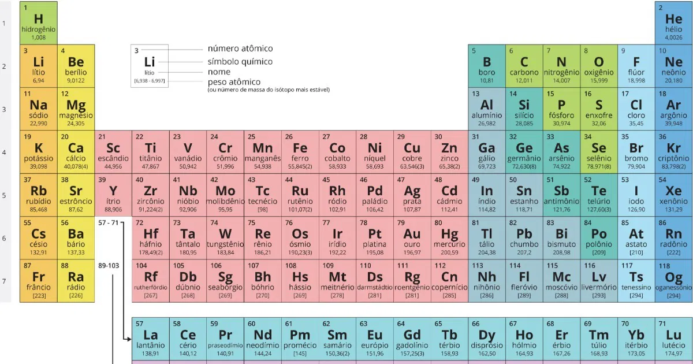
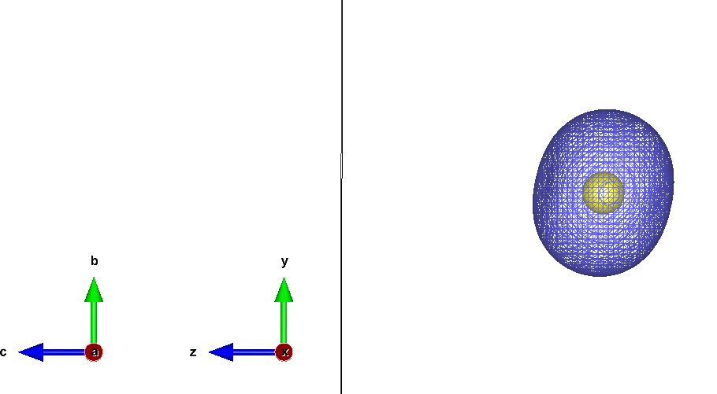
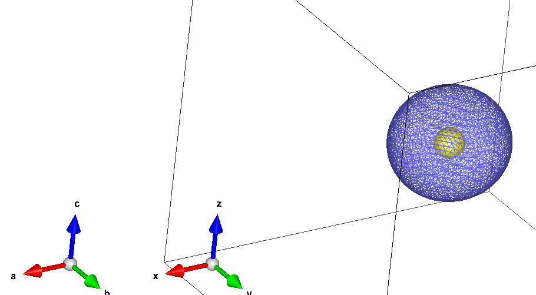
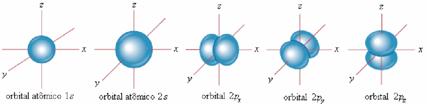
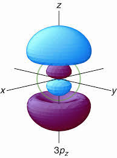
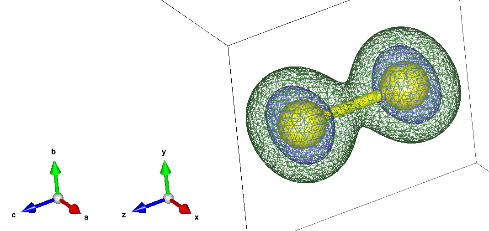
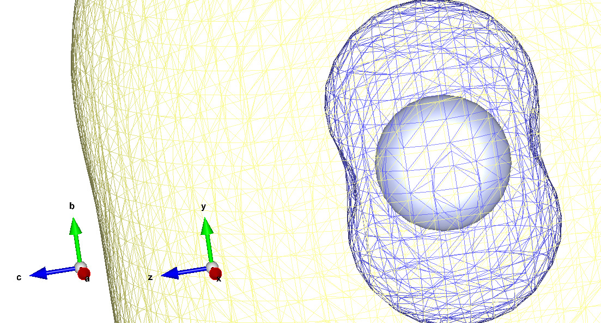
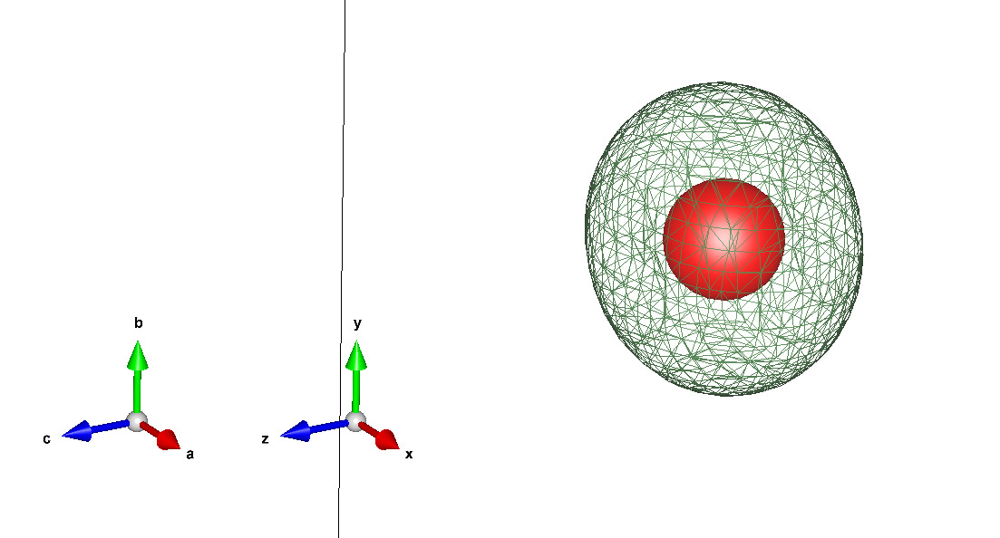

# Tópicos em Cálculo de Estrutura Eletrônica REPO

Fonte: BATISTA, Carolina. Tabela Periódica. Toda Matéria, [s.d.]. 2025.

## Trabalho 1: Densidade eletrônica pelo método de HF

> [!WARNING]
> A menos que evidenciado explicitamente, todos os valores desta sessão (Trabalho 1) estarão em unidades atómicas.

A energia de Coesão é dada por

$$
E_{coesão} = E_{molécula} - \sum{E_{átomo}}
$$

### Moléculas Diatómicas

> Molécula de Enxofre

 

Fonte: Menezes, V. M. d. (2008). Nanotubos de carbono interagindo com vitaminaS B3 e C: Um estudo de primeiros princípios.

${E_{ef}}_{S} =  -395.47186850$

${E_{ef}}_{S2} =   -791.05336569$

$$E_{coesão} = E_{S2} - 2E_S$$
$$E_{coesão} = -791.05336569 - 2\(-395.47186850\)$$
$$E_{coesão} = -0.10962869$$

> Monóxido de Carbono

### Moléculas Triatómicas

> Dióxido de Nitrogênio

${E_{ef}}_{N} =  -54.24827299$

${E_{ef}}_{O} = -74.26744989$

${E_{ef}}_{NO2} = -204.04682048$

### Moléculas Poliatómicas

> Água Oxigenada

---
