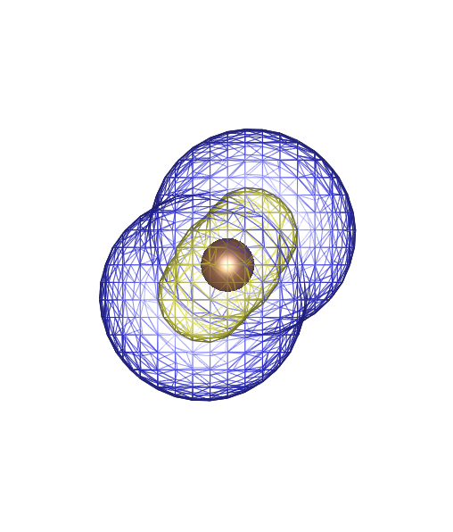
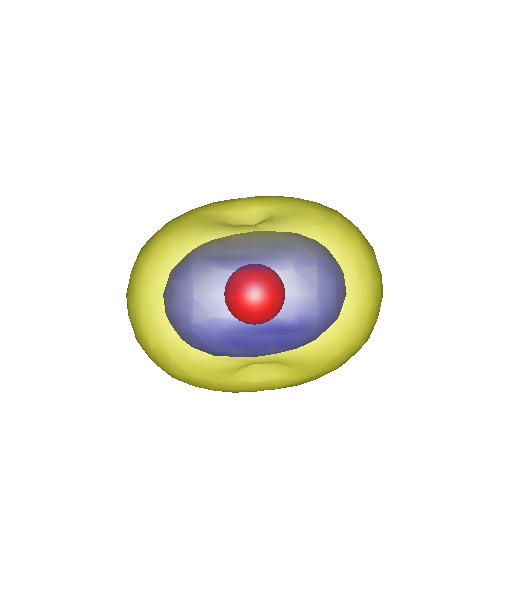
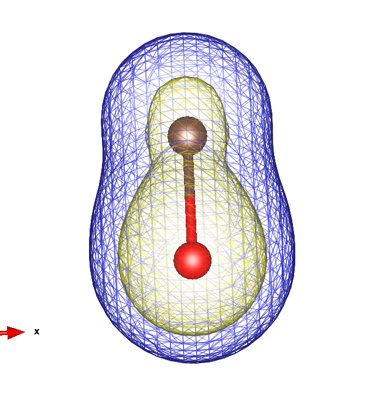
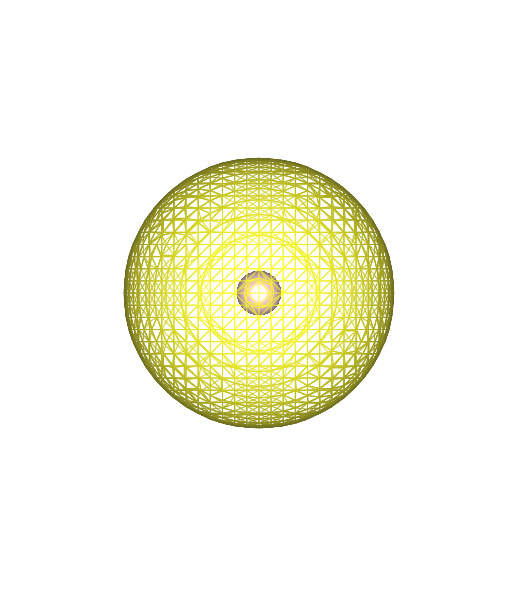
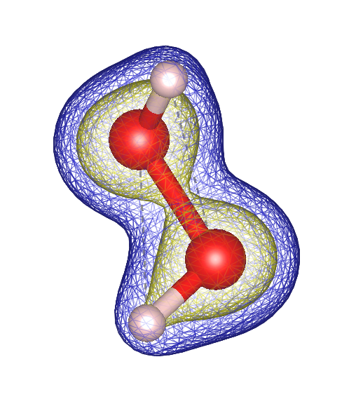

# Tópicos em Cálculo de Estrutura Eletrônica REPO

Fonte: BATISTA, Carolina. Tabela Periódica. Toda Matéria, [s.d.]. 2025.

## Trabalho 1: Densidade eletrônica pelo método de HF

> [!WARNING]
> A menos que evidenciado explicitamente, todos os valores desta sessão (Trabalho 1) estarão em unidades atômicas.

A energia de Coesão é dada por

$$
E_{coesão} = E_{molécula} - \sum{E_{átomo}}
$$

### Moléculas Diatómicas

> Molécula de Enxofre

 

Fonte: Menezes, V. M. d. (2008). Nanotubos de carbono interagindo com vitaminaS B3 e C: Um estudo de primeiros princípios.

${E_{ef}}_{S} =  -395.47186850$

${E_{ef}}_{S2} =   -791.05336569$

$$E_{coesão} = E_{S2} - 2E_S$$
$$E_{coesão} = -791.05336569 - 2\(-395.47186850\)$$
$$E_{coesão} = -0.10962869$$

> Monóxido de Carbono

ÁTOMO CARBONO:

 

${E_{ef}}_{C} =  -37.598779037346$

ÁTOMO OXIGENIO:

 

${E_{ef}}_{O} =  -74.670628420287$

MOLÉCULA CO:

 

 

${E_{ef}}_{CO} =  -112.756427738892$

Energia de Coesão: 

$$E_{coesão} = E_{CO} - \(E_C + 2E_O\)$$
$$E_{coesão} = -112.756427738892 - \[-37.598779037346 + \(-74.26744989\)\]$$
$$E_{coesão} = -0.4870202812589923$$

Percebe-se que a energia da molécula é menor que a energia dos átomos individualmente, dessa forma a molécula é mais estável que os átomos de C e O sozinhos.

### Moléculas Triatómicas

> Dióxido de Nitrogênio

${E_{ef}}_{N} =  -54.24827299$

${E_{ef}}_{O} = -74.26744989$

${E_{ef}}_{NO2} = -204.04682048$

$$E_{coesão} = E_{NO2} - \(E_N + 2E_O\)$$
$$E_{coesão} = -204.04682048 - \[-54.24827299 + 2\(-74.26744989\)\]$$
$$E_{coesão} = -1.26364771$$

### Moléculas Poliatómicas

> Água Oxigenada

ÁTOMO HIDROGÊNIO:

 

${E_{ef}}_{H} = -0.499334315440$

ÁTOMO OXIGÊNIO:

 

${E_{ef}}_{O} = -74.670628420287$

MOLÉCULA H2O2:

 

${E_{ef}}_{H2O2} = -150.806020330003$

Energia de Coesão: 

$$E_{coesão} = E_{H2O2} - \(2E_H + 2E_O\)$$
$$E_{coesão} = -150.806020330003 - \[2\(-0.499334315440\) + 2\(-74.26744989\)\]$$
$$E_{coesão} = -0.4660948585490132$$

Percebe-se que a energia da molécula é menor que a energia dos átomos individualmente, dessa forma a molécula é mais estável que os átomos de H e O sozinhos.

---
