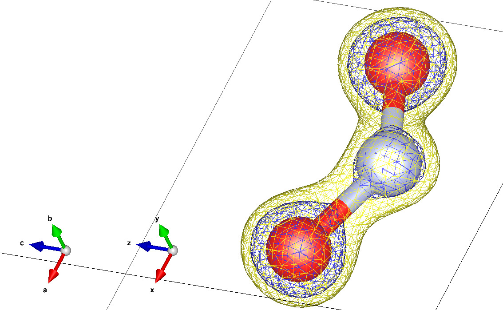

# Tópicos em Cálculo de Estrutura Eletrônica REPO

Fonte: BATISTA, Carolina. Tabela Periódica. Toda Matéria, [s.d.]. 2025.

## Trabalho 1: Densidade eletrônica pelo método de HF

### Moléculas Diatómicas

> Molécula de Enxofre

 

Fonte: Menezes, V. M. d. (2008). Nanotubos de carbono interagindo com vitaminaS B3 e C: Um estudo de primeiros princípios.

> Monóxido de Carbono

### Moléculas Triatómicas

> Dióxido de Nitrogênio

### Moléculas Poliatómicas

> Água Oxigenada

---
